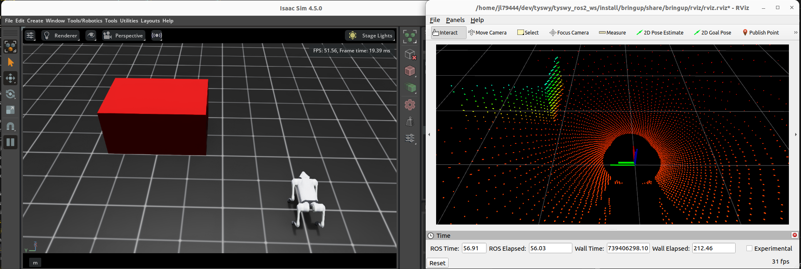

# go2_isaac_ros2



This package allows **low-level** (or joint-level), ROS2 control of a Unitree Go2 quadruped robot being simulated in Isaac Sim. This package is built on top of [IsaacLab](https://github.com/isaac-sim/IsaacLab).


| Tested With        | Version   |
|--------------------|----------|
| Ubuntu            | 22.04    |
| ROS2              | Humble   |
| Isaac Sim         | 4.5.0    |
| Isaac Lab         | 2.0.0    |

TODO:

|  | Feature                      |
|--------|--------------------------------------|
| ✅ | Joint position targets             |
| ⬜ | Joint velocity targets                |
| ⬜ | Joint-level specification of Kp and Kd (proportional and derivative gain) |
| ❌ | Joint torque control   |
| ✅ | Joint state and IMU      |
| ✅ | Head LiDAR  |
| ⬜ | Front camera      |
| ⬜ | Terrain selection |

## Installation

First, ensure [ROS2 Humble](https://docs.ros.org/en/humble/Installation/Ubuntu-Install-Debs.html) is installed.

It is recommended to install Isaac Lab within a conda / miniconda environment. Create an environment:

```bash
conda create -n go2_isaac_ros2 python=3.10
conda activate go2_isaac_ros2
```

Then install [IsaacLab](https://github.com/isaac-sim/IsaacLab) per the their instructions.

Next, create a ROS2 workspace and clone this repository into the `src` directory:

```bash
mkdir -p ~/go2_isaac_ros2_ws/src
cd ~/go2_isaac_ros2_ws/src
git clone https://github.com/CLeARoboticsLab/go2_isaac_ros2.git
```

You will also need to clone the Unitree ROS2 SDK into the `src` directory:

```bash
cd ~/go2_isaac_ros2_ws/src
git clone https://github.com/unitreerobotics/unitree_ros2.git
```

Then build the workspace:

```bash
cd ~/go2_isaac_ros2_ws
source /opt/ros/humble/setup.bash
colcon build
```

Next, you will need to copy the Unitree_L1.json file from this package into Isaac Sim's LIDAR config files. Use the following, replacing `<PATH_TO_ISAAC_SIM>` with the path to your Isaac Sim installation. For a miniconda environment, this could look like `~/miniforge3/envs/tyswy/lib/python3.10/site-packages/isaacsim/`.

```bash
cp ~/go2_isaac_ros2_ws/src/go2_isaac_ros/Unitree_L1.json <PATH_TO_ISAAC_SIM>/exts/isaacsim.sensors.rtx/data/lidar_configs/
```

⚠️ Note, as of 2025-02-12, [this PR](https://github.com/isaac-sim/IsaacLab/pull/1809) is required to use the LIDAR sensor in Isaac Sim. This PR has not yet been merged into Isaac Lab. You will manually need to edit `IsaacLab/source/isaaclab/isaaclab/envs/manager_based_env.py` per [this comment](https://github.com/isaac-sim/IsaacLab/issues/1423#issuecomment-2484033748).

## Usage

First, start the simulator:

```bash
cd ~/go2_isaac_ros2
source install/setup.bash
conda activate go2_isaac_ros2
ros2 launch go2_isaac_ros2 launch_sim.py
```

Controlling the robot within Isaac Sim is the same as with hardware. To control the robot, publish `unitree_go.msg.LowCmd` messages to the `/lowcmd` topic.

Similarly, to receive observations from the robot, subscribe to the `/lowstate` and `/utlidar/cloud` topics.

Note: `/clock` is also published by this package to allow for time synchronization with the simulator. To synchronize ROS2 with the simulator, be sure to set the `use_sim_time: true` parameter when launching all nodes.

## Acknowledgements

This package is based on the [go2_omniverse](https://github.com/abizovnuralem/go2_omniverse) package by @abizovnuralem.